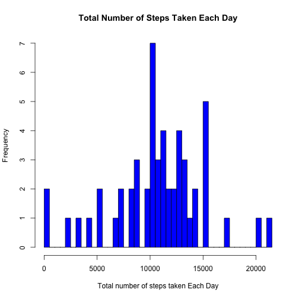
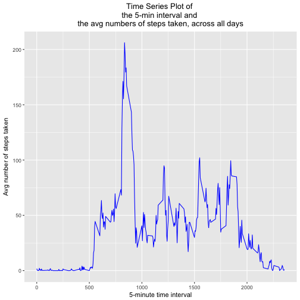
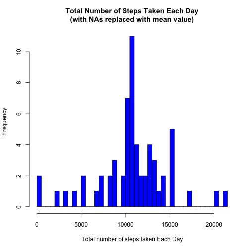
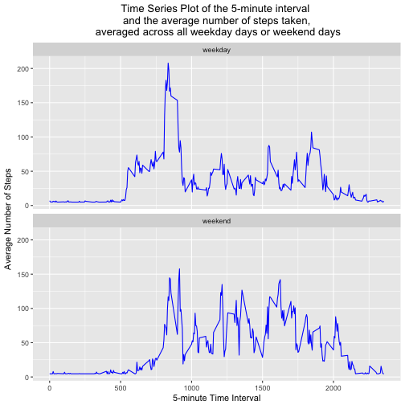

```r
library(ggplot2)
```

## Loading and preprocessing the data
**1. Load the data **


```r
library(ggplot2)
if(!file.exists('activity.csv')){
    unzip('activity.zip')
}
activity_data <- read.csv("activity.csv", stringsAsFactors = FALSE)
str(activity_data)
```

```
## 'data.frame':	17568 obs. of  3 variables:
##  $ steps   : int  NA NA NA NA NA NA NA NA NA NA ...
##  $ date    : chr  "2012-10-01" "2012-10-01" "2012-10-01" "2012-10-01" ...
##  $ interval: int  0 5 10 15 20 25 30 35 40 45 ...
```

##  What is mean total number of steps taken per day?

**1. Calculate the total number of steps taken per day. **


```r
activity_nona <- activity_data[complete.cases(activity_data),]
steps_perday <- aggregate(steps ~ date,activity_nona,sum)
head(steps_perday)
```

```
##         date steps
## 1 2012-10-02   126
## 2 2012-10-03 11352
## 3 2012-10-04 12116
## 4 2012-10-05 13294
## 5 2012-10-06 15420
## 6 2012-10-07 11015
```

**2.  Make histogram of the total number of steps taken each day**


```r
hist(steps_perday$steps,breaks=50,main="Total Number of Steps Taken Each Day",xlab="Total number of steps taken Each Day",col="blue")
```



**3. Calculate and report the mean and median of the total number of steps taken per day **


```r
mean_perday <- round(mean(steps_perday$steps))
median_perday <- median(steps_perday$steps)
```

* Mean Per Day : 10766

* Median Per Day : 10765

 
## What is the average daily activity pattern?

**1. Make a time series plot (i.e. 𝚝𝚢𝚙𝚎 = "𝚕") of the 5-minute interval (x-axis) and the average number of steps taken, averaged across all days (y-axis)**


```r
avgsteps <- aggregate(steps ~ interval, activity_nona, mean)
```


```r
ggplot(data=avgsteps,aes(x=interval,y=steps))+geom_line(colour="blue")+xlab("5-minute time interval")+ylab("Avg number of steps taken")+labs(title="Time Series Plot of \nthe 5-min interval and \nthe avg numbers of steps taken, across all days")+theme(plot.title = element_text(hjust = 0.5))
```



**2. Which 5-minute interval, on average across all the days in the dataset, contains the maximum number of steps? **


```r
max_step <- max(avgsteps$steps)
mean_5minInt <- avgsteps[avgsteps$steps==max_step,]
```

* The 5-minute interval that contains the max number of steps : 835

## Imputing missing values

**1. Calculate and report the total number of missing values in the dataset (i.e. the total number of rows with 𝙽𝙰s) **


```r
activity_na <- activity_data[!complete.cases(activity_data),]
count_na <- nrow(activity_na)
```

* The total number of missing values in the dataset : 2304


**2. Devise a strategy for filling in all of the missing values in the dataset. The strategy does not need to be sophisticated. For example, you could use the mean/median for that day, or the mean for that 5-minute interval, etc. **


```r
# find index of the missing values
na_pos <- which(is.na(activity_data$steps))
#create a vector containing means 
mean_vec <- rep(mean(activity_data$steps,na.rm=TRUE),length(na_pos))
```


**3. Create a new dataset that is equal to the original dataset but with the missing data filled in. **


```r
activity_data2 <- activity_data
activity_data2[na_pos,"steps"] <- mean_vec
head(activity_data2)
```

```
##     steps       date interval
## 1 37.3826 2012-10-01        0
## 2 37.3826 2012-10-01        5
## 3 37.3826 2012-10-01       10
## 4 37.3826 2012-10-01       15
## 5 37.3826 2012-10-01       20
## 6 37.3826 2012-10-01       25
```

**4. Make a histogram of the total number of steps taken each day  **


```r
steps_perday2 <- aggregate(steps ~ date,activity_data2,sum)
```


```r
hist(steps_perday2$steps,breaks=50,main="Total Number of Steps Taken Each Day\n(with NAs replaced with mean value)",xlab="Total number of steps taken Each Day",col="blue")
```



 and Calculate and report the mean and median total number of steps taken per day. 


```r
mean_perday2 <- mean(steps_perday2$steps)
median_perday2 <- median(steps_perday2$steps)
```

* Mean Per Day with no missing values :10766

* Median Per Day with no missing values:10766


From the first part of the assignment, mean and median values with NA values were as below:

* Mean Per Day with missing value :10766

* Median Per Day with missing value :10765

```
After comparing, it show that the values do not differ much. Hence the impact of imputing missing data on estimates of the total daily steps is very minimal.
```

## Are there differences in activity patterns between weekdays and weekends?

**1. Create a new factor variable in the dataset with two levels – “weekday” and “weekend” indicating whether a given date is a weekday or weekend day. **


```r
activity_data3<-activity_data2
weekdays<-weekdays(as.Date(activity_data3$date)) %in% c("Saturday","Sunday")
activity_data3$daytype<-"weekday"
activity_data3$daytype[weekdays == TRUE] <- "weekend"
activity_data3$daytype <- as.factor(activity_data3$daytype)
str(activity_data3)
```

```
## 'data.frame':	17568 obs. of  4 variables:
##  $ steps   : num  37.4 37.4 37.4 37.4 37.4 ...
##  $ date    : chr  "2012-10-01" "2012-10-01" "2012-10-01" "2012-10-01" ...
##  $ interval: int  0 5 10 15 20 25 30 35 40 45 ...
##  $ daytype : Factor w/ 2 levels "weekday","weekend": 1 1 1 1 1 1 1 1 1 1 ...
```

**2. Make a panel plot containing a time series plot (i.e. 𝚝𝚢𝚙𝚎 = "𝚕") of the 5-minute interval (x-axis) and the average number of steps taken, averaged across all weekday days or weekend days (y-axis) **


```r
avg_data<- aggregate(steps ~ interval+daytype, activity_data3,mean)
```


```r
g<-ggplot(avg_data,aes(interval,steps))
g+geom_line(colour="blue")+facet_wrap(~daytype,ncol=1)+labs(title="Time Series Plot of the 5-minute interval \nand the average number of steps taken,\n averaged across all weekday days or weekend days")+theme(plot.title = element_text(hjust = 0.5))+xlab("5-minute Time Interval")+ylab("Average Number of Steps")
```




